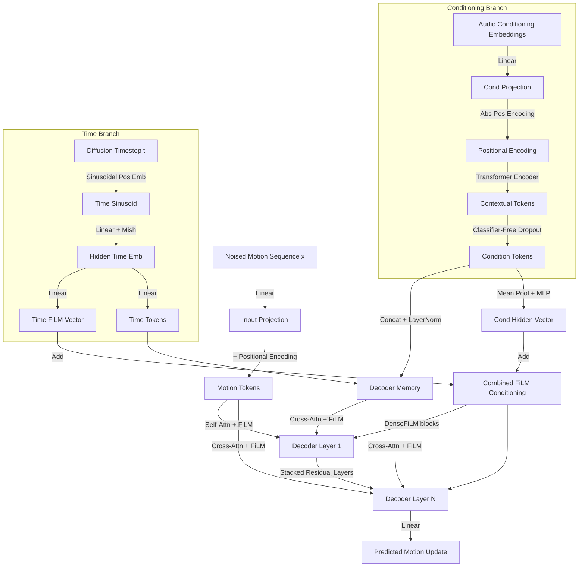

# EDGE DanceDecoder Data Flow

This diagram summarizes how motion, music, and diffusion timestep signals flow through the `DanceDecoder` defined in [`model/model.py`](../model/model.py). Motion tokens repeatedly attend to the concatenated conditioning/time memory while FiLM modulation injects the combined conditioning vector into every sub-layer.
